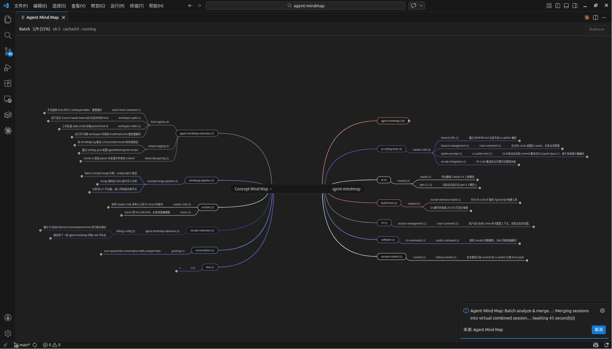

# Agent Mind Map

[](https://github.com/abeelu688/agent-mindmap/actions/workflows/ci.yml)
[](LICENSE)
[](https://code.visualstudio.com/)
[](README.zh-cn.md)

A VS Code extension that reads AI agent chat transcripts and renders them as **interactive mind maps**.

**[中文文档 / Chinese README →](README.zh-cn.md)**

---



## Supported Products

| Product         | Headless CLI             |
| --------------- | ------------------------ |
| **Cursor**      | `agent` / `cursor-agent` |
| **Claude Code** | `claude -p`              |

Set `agentMindmap.host` to `auto` (default), `cursor`, or `claude-code`. In `auto` mode, the extension detects your editor and falls back to scanning both directories.

The mind map is **read-only** — it does not write back to chat storage or affect the Agent panel.

## LLM Integration

Agent Mind Map uses an LLM to analyze each conversation, extract the main concepts, and organize them into a readable topic structure. It can also merge multiple analyzed sessions into a project-level concept map.

The extension runs the matching **headless CLI** as a subprocess, so **no separate API key is required**. It reuses your existing product subscription.

| Host        | Command                                                        |
| ----------- | -------------------------------------------------------------- |
| Cursor      | `agent -p --force --trust --output-format json <prompt>`       |
| Claude Code | `claude -p --bare --output-format json --max-turns 1 <prompt>` |

## Commands

| Command                                                    | Description                                                                                       |
| ---------------------------------------------------------- | ------------------------------------------------------------------------------------------------- |
| **Agent Mind Map: Open Latest Session**                    | Load the most recent transcript and show a single-session mind map                                |
| **Agent Mind Map: Choose Session…**                        | Pick a transcript by title + time                                                                 |
| **Agent Mind Map: Analyze All Sessions (Current Project)** | Scan every transcript, run per-session LLM analysis, then build and open the **Concept Mind Map** |

Loading commands that call the LLM show a **cancellable progress notification** with step-by-step status text.

## Click Nodes to Open Transcripts

Every mind-map node is clickable. The extension traces the node back to its originating session and turn, then opens a readable Markdown transcript in the editor.

## Offline Export

Right-click the empty canvas → **Download mind map & transcripts…**. The export includes:

- A self-contained `index.html` mind map
- Pre-rendered `transcripts/*.html` (and `*.md` for editors)

No local HTTP server required — just open `index.html` in a browser. Clicking nodes opens the matching transcript at the correct anchor.

## Development

```bash
cd agent-mindmap
npm install
npm install --prefix extension
npm install --prefix webview
npm run build
npm test
```

Press **F5** in VS Code to launch the Extension Development Host.

See [CONTRIBUTING.md](CONTRIBUTING.md) for the full contribution guide and [CLAUDE.md](CLAUDE.md) for the architecture overview.

## Roadmap

Open for community contribution:

- [ ] Full UI translations for additional languages
- [ ] Migrate production LLM prompts to language-aware `TEXTS` patterns:
      `session-analysis`, `code-ref-descriptions`, and `merge-session-analysis`
- [ ] Add eval coverage for non-Chinese prompt variants before switching `auto` prompt language to English
- [ ] And more ideas from real-world usage and community feedback

## Privacy

Transcripts may contain local file paths and code snippets. The extension sends transcript content to the configured CLI (`cursor-agent` or `claude`), which forwards it under your existing subscription terms. The library only stores summarized `TopicGraph` and metadata — **not** the raw transcript. There is **no telemetry** and no third-party server.

See [`PRIVACY.md`](PRIVACY.md) for the full privacy policy.

## License

[MIT](LICENSE)
