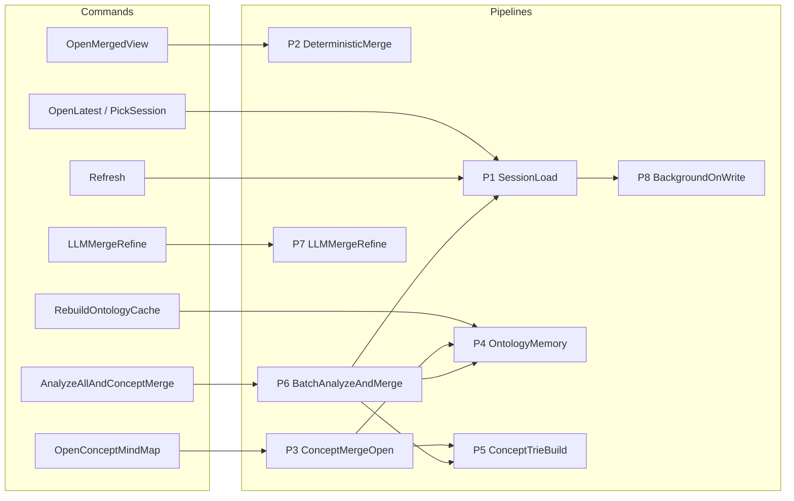
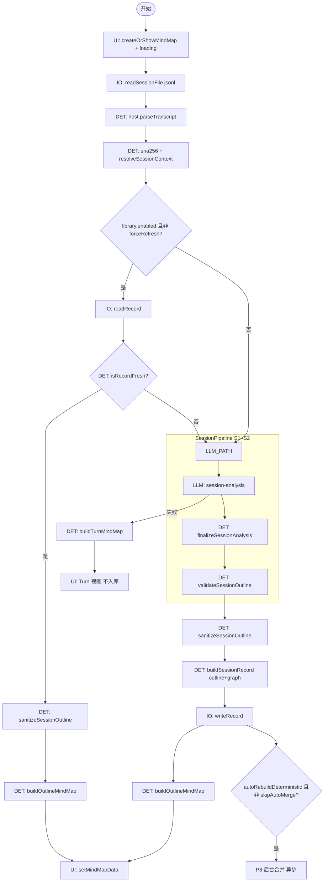
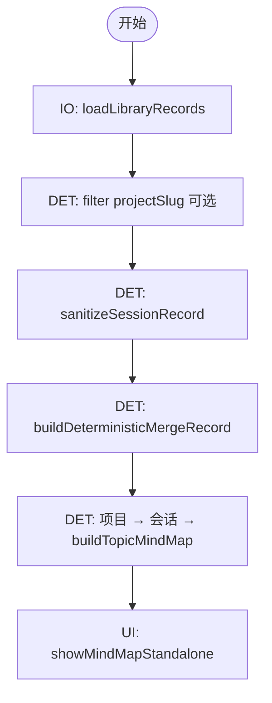
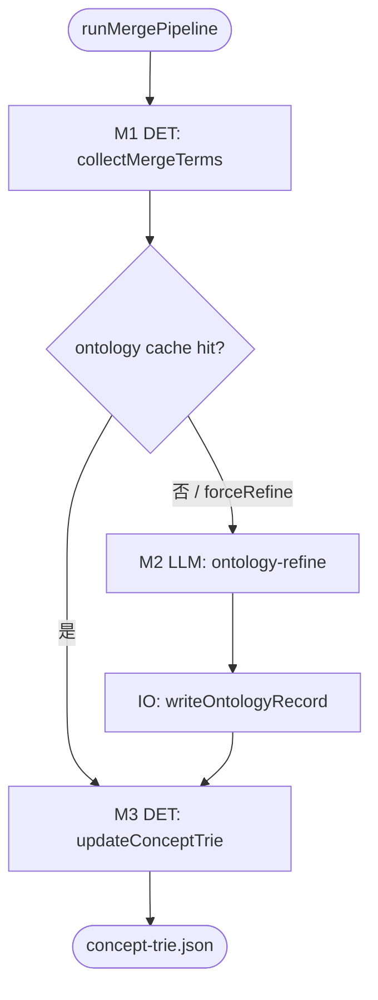
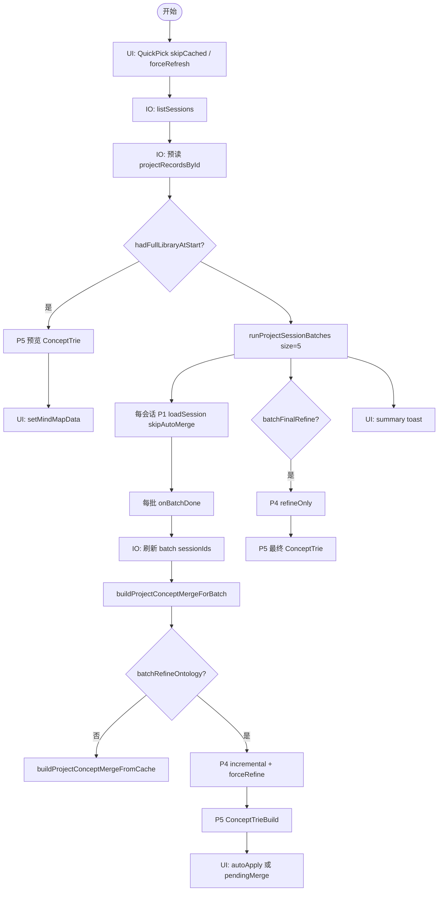
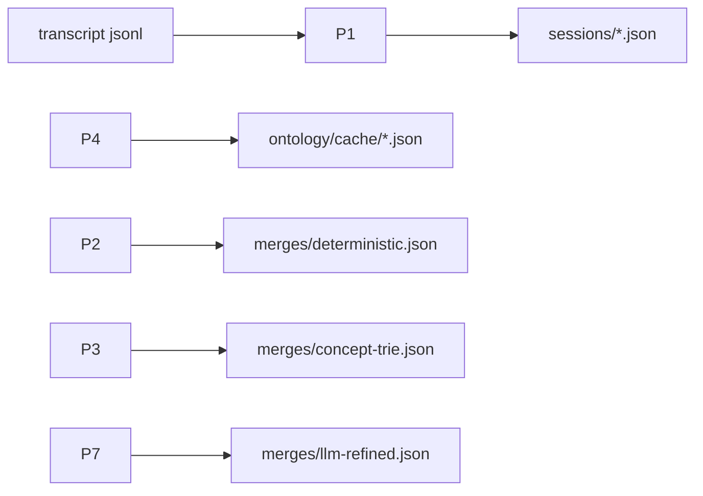

# Agent Mind Map — 全量 Pipeline 与 Review 清单

本文档对照当前代码（2026-05）梳理 8 条 pipeline 的**每个节点**，并给出已核对项、优先优化项与改法对比。  
代码入口见 [`extension/src/extension.ts`](../extension/src/extension.ts)。

## 图例

| 标记 | 含义 |
|------|------|
| **LLM** | `provider.summarize()`（Cursor `agent` / Claude `claude -p`） |
| **DET** | 纯确定性逻辑 |
| **IO** | 磁盘 / 库读写 |
| **UI** | Webview / 进度 / QuickPick |

---

## Pipeline 总览（命令 → Pipeline）

| VS Code 命令 ID | 函数 | Pipeline |
|-----------------|------|----------|
| `openLatest` / `pickSession` | `commandOpenLatest` / `commandPickSession` | **P1** |
| `refresh` | `commandRefresh` | **P1**（`forceRefresh`） |
| `openMerged` / `openMergedCurrentProject` | `commandOpenMerged*` | **P2** |
| `openConceptMerged` / `openConceptMergedCurrentProject` | `commandOpenConceptMerged*` | **P3** → P4 + P5 |
| `analyzeAndMergeCurrentProject` | `commandAnalyzeAndMergeCurrentProject` | **P6** → P1 + P4 + P5 |
| `llmMergeRefine` | `commandLlmMergeRefine` | **P7** |
| `rebuildOntologyCache` | `commandRebuildOntologyCache` | 清缓存；下次 **P4** 全量重跑 |



### 代码核对结论（confirm-pipelines）

| Pipeline | 与代码一致 | 补充说明 |
|----------|------------|----------|
| P1 | ✅ | `runSessionPipeline` S1 analyze + S2 finalize → [`sessionPipeline.ts`](../extension/src/pipeline/sessionPipeline.ts) |
| P2 | ✅ | `buildDeterministicMergeRecordAsync` → [`mergeDeterministic.ts`](../extension/src/store/mergeDeterministic.ts) |
| P3 | ✅ | `ensureConceptMerge` 三层 fallback → [`extension.ts`](../extension/src/extension.ts) L641–697 |
| P4 | ✅ | **MergePipeline M1–M2**：`collectMergeTerms` + `mergeSynonyms`（无独立 Extract/TopicPaths LLM）→ [`mergePipeline.ts`](../extension/src/pipeline/mergePipeline.ts) |
| P5 | ✅ | `insertPath` + `mergeTrieSiblingsByEquivalences` → [`mergeConceptTrie.ts`](../extension/src/store/mergeConceptTrie.ts) |
| P6 | ✅ | `batchSize=5`，`skipAutoMerge=true`；`shouldAutoApplyBatchUpdates` / `hadFullLibraryCoverage` → [`batchMergeApplyMode.ts`](../extension/src/batchMergeApplyMode.ts) |
| P7 | ✅ | `mergeWithLlm` + `computeMergeCacheKey` → [`mergeLlm.ts`](../extension/src/store/mergeLlm.ts) |
| P8 | ✅ | `writeRecord` 后 `void (async () => …)`，批处理显式跳过 |

---

## P1 — 单会话加载（Session Load）

**触发**：Open Latest / Choose Session / Refresh / P6 内 `loadSession`



| 节点 | 类型 | 文件 |
|------|------|------|
| runSessionPipeline | LLM×1 + DET | [`sessionPipeline.ts`](../extension/src/pipeline/sessionPipeline.ts) |
| buildOutlineMindMap | DET | [`buildOutlineMindMap.ts`](../extension/src/mindmap/buildOutlineMindMap.ts) |
| writeRecord | IO | [`sessionStore.ts`](../extension/src/store/sessionStore.ts) |

契约见 [`.cursor/rules/conversation-data-flow.mdc`](../.cursor/rules/conversation-data-flow.mdc)。

---

## P2 — 确定性合并视图（Merged View）

**触发**：Open Merged View (All / Current Project)



全程无 LLM。

---

## P4 — 合并同义 / Ontology 缓存（MergePipeline M1–M2）

**触发**：`runMergePipeline` / `ensureOntologyMemory`（[`mergePipeline.ts`](../extension/src/pipeline/mergePipeline.ts)、[`ontologyStore.ts`](../extension/src/store/ontologyStore.ts)）



| 步骤 | 类型 | 产出 |
|------|------|------|
| M1 collectMergeTerms | DET | nodes, mappings, topicPaths（来自各会话 `conceptExtract` / `treeSnapshot`） |
| M2 mergeSynonyms | LLM | `segmentEquivalences`（带 scope） |
| M3 updateConceptTrie | DET | 更新 concept trie；**不**重写各会话 `outline` |

单会话 **不再** 调用 bulk `concept-ontology` Extract 或 `topic-paths` LLM。

---

## P5 — Concept Trie 构建（纯 DET）

**触发**：`buildConceptMergeRecord` / `buildConceptTrieMindMap`

```mermaid
flowchart TB
    start([buildConceptMergeWithOntology]) --> IO1[IO: loadSegmentEquivalencesForRecords]
    IO1 --> DET1[DET: prepareRecordsForConceptMerge]
    DET1 --> apply{ontology 会话集完全匹配?}
    apply -->|是| DET2[DET: applyTopicPathsFromOntology]
    apply -->|否| trie
    DET2 --> trie

    subgraph trie [buildConceptTrieStructure]
        trie --> DET3[DET: 遍历 topics]
        DET3 --> DET4[DET: insertPath]
        DET4 --> DET5[DET: resolveConceptPathWithEquivalences]
        DET5 --> DET6[DET: trie 下探 segmentKeyForMerge]
        DET6 --> DET7[DET: mergeTrieSiblingsByEquivalences]
    end

    DET7 --> DET8[DET: renderNode → MindMapRoot]
    DET8 --> end_node([MergeRecord])
```

Path 解析：[`resolveConceptPathWithEquivalences.ts`](../extension/src/llm/resolveConceptPathWithEquivalences.ts) → [`normalizeConceptPath.ts`](../extension/src/llm/normalizeConceptPath.ts)（仅机械去重/截断，无硬编码域名）。

---

## P3 — 打开 Concept Mind Map

**入口**：`ensureConceptMerge`（[`extension.ts`](../extension/src/extension.ts) L641）

1. `loadLibraryRecords` → filter  
2. **Try**：`ensureOntologyAndBuildConceptMerge`（P4 + P5）  
3. **Fallback 1**：`buildProjectConceptMergeFromCache`（只读 ontology 缓存 equivalences）  
4. **Fallback 2**：`buildConceptMergeWithOntology`（无 equivalences，纯机械 normalize）  
5. 全库时写 `merges/concept-trie.json`；UI 提示 orphans / 未分类

---

## P6 — 批量分析并 Concept 合并

**入口**：`commandAnalyzeAndMergeCurrentProject`



### P6 LLM 调用量（N 会话，批大小 5）

| 阶段 | 次数（量级） | 条件 |
|------|--------------|------|
| SessionAnalysis | ≤ N | 每未缓存/强制刷新会话 **1 次**（S1 analyze） |
| Refine（批内） | ⌈processed/5⌉ | `batchRefineOntology=true` → MergePipeline M2 |
| Refine（最终） | 1 | `batchFinalRefine=true` |

配置项：`agentMindmap.library.batchRefineOntology`、`batchFinalRefine`（默认均为 true）。

---

## P7 — LLM 跨会话合并精炼

与 Concept Trie **不同语义**：产出叙事性 `MergedOutline`（`kind: llm-refined`），非 path 树。

---

## P8 — 单会话入库后后台合并

`writeRecord` 成功后异步：deterministic merge +（可选）incremental ontology → `concept-trie.json`。  
P6 设 `skipAutoMerge: true` 避免重复。

---

## 数据流



---

## 优先 Review 项（prioritize-opt）

按计划建议，结合 P6 日常使用，**优先讨论以下 6 项**：

| 优先级 | ID | 主题 | 关联 Pipeline |
|--------|-----|------|---------------|
| P0 | **#4** | 批处理 Refine 频率与成本 | P6 / P4 |
| P0 | **#8** | insertPath 与 sibling merge 双重 resolve | P5 |
| P0 | **#9** | 无 equivalences 时的合并质量 | P3 / P5 |
| P0 | **#14** | Concept Trie vs LLM Merge 两套语义 | P5 / P7 |
| P1 | **#1** | 双份 conceptPath（Outline vs TopicPaths） | P1 / P4 |
| P1 | **#16** | 批分析串行 vs 限流并行 | P6 / P1 |

次要 backlog：**#5 #6 #7 #10 #11 #12 #13 #15 #17**（见文末索引）。

---

## Deep-dive：改法对比（cost / quality / effort）

### #4 批处理 Refine 频率

**现状**：每处理 5 会话 → `ensureIncrementalOntologyAndBuildConceptMerge`（`forceRefine: true`）；全部结束后再 `refineOnly` 一次。

| 方案 | LLM 成本 | 合并质量 | 实现量 | 说明 |
|------|----------|----------|--------|------|
| A 维持现状 | 高（~N/5 + 1 次 refine） | 高，边分析边修正同义段 | 无 | 当前默认 |
| B 仅 final refine | 低（+1 次） | 中，批中树可能短暂不一致 | 小 | 关 `batchRefineOntology` 或批内跳过 refine |
| C 仅批内 refine | 中（~N/5） | 中–高，无最终全局 pass | 小 | 关 `batchFinalRefine` |
| D 增量 refine 输入 diff | 中 | 高 | 中 | 仅把**新 session 的 contextSamples** 送入 refine prompt，不全量 records |
| E 缓存键按 project 单键 + 版本号 | 中–低 | 高 | 大 | session 集合变化时 refine-only 追加，避免重跑 Extract/TopicPaths |

**建议**：短期 **B+C 可配置**已存在；中期 **D**；长期 **E**。

---

### #8 双重 resolveConceptPathWithEquivalences

**现状**：`insertPath` 对每条 path resolve 一次；`mergeTrieSiblingsByEquivalences` 对同级再 resolve 取 canonical key。

| 方案 | 性能 | 正确性 | 实现量 |
|------|------|--------|--------|
| A 维持 | 2× resolve/topic | 已验证 | 无 |
| B insert 时写 canonical key 到 TrieNode | 1× | 需保证 sibling merge 与 insert 同规则 | 中 |
| C 先 bulk normalizePaths(records) 再 insert | 1× | 需统一 topic + sibling 上下文 | 中 |
| D 仅 sibling merge 用 key 比较，不再 full resolve | 略减 | 可能丢 evidence scope | 小，风险高 |

**建议**：**B 或 C**，在 P5 单测覆盖 `runtime→android→art` 等等价场景。

---

### #9 无 segmentEquivalences 时打开 Concept 图

**现状**：P3 fallback 可落到纯 `normalizeConceptPath`（去重/截断），无领域对齐。

| 方案 | 用户体验 | 成本 | 实现量 |
|------|----------|------|--------|
| A 维持 + 提示 | 可能出现错误并列分支 | 无 LLM | 无 |
| B 强制跑 P4 才展示 | 慢，但树可靠 | 1–3+ LLM | 小（UI gate） |
| C 只读缓存 equivalences，无则 blocking 提示 + 一键 Rebuild | 清晰 | 0 或延迟 LLM | 小 |
| D 降级显示「机械合并预览」水印 | 诚实 | 无 | 小 |

**建议**：**C + D**（与现有 `ui.batch.noOntologyEquivalences` 文案统一）。

---

### #14 Concept Trie vs LLM Merge Refine

| 维度 | Concept Trie (P5) | LLM Merge (P7) |
|------|-------------------|----------------|
| 结构 | path 前缀树 | 叙事大纲 |
| LLM | 仅 ontology（P4） | 每次 merge 1 次 |
| 可重复性 | 高（确定性 + 缓存 equivalences） | 中（缓存 hash） |
| 适用 | 跨会话**概念索引** | 跨会话**阅读摘要** |

| 方案 | 说明 |  effort |
|------|------|--------|
| A 文档 + 命令副标题区分 | README / 命令 palette description | 小 |
| B UI 根节点 badge：`Concept · path trie` / `LLM · narrative` | 防混淆 | 小 |
| C  deprecate P7 或合并为「Concept 图的 LLM 摘要层」 | 产品决策 | 大 |

**建议**：**A + B** 先做；P7 保留给「想要一篇 merged 文章式大纲」的用户。

---

### #1 双份 conceptPath 来源

**现状**：
- P1：Outline 叶子 `conceptPath`（或 derive 自标题链）
- P4：`topicPaths` LLM 按 ontology nodes 再推断
- P5：`applyTopicPathsFromOntology` **仅当** ontology.meta.sessionIds 与当前 records **完全一致** 时覆盖

| 方案 | 质量 | 成本 | 说明 |
|------|------|------|------|
| A Outline 为准，TopicPaths 仅补缺失 | 低冗余 | 少 LLM | 改 infer 条件 |
| B TopicPaths 为准（打开 Concept 前总是 apply） | 跨会话一致 | 多 LLM | 加强 ontology 权威 |
| C 合并策略：equivalence resolve 后取较长/较深 path | 折中 | 无 | DET 规则 |
| D 单会话只写 Outline，TopicPaths 只服务 merge | 清晰分工 | 中 | 产品文档化 |

**建议**：**D + B 的弱形式**——默认以 Outline 入库；Concept 打开时用 TopicPaths **修正**仅当 ontology 完整且 confidence 高。

---

### #16 批分析并行度

**现状**：`runProjectSessionBatches` 内串行 `loadSession`（每会话 subprocess LLM）。

| 方案 | 吞吐 | 风险 | 实现量 |
|------|------|------|--------|
| A 串行（现状） | 低 | 低 | 无 |
| B 池化并行 k=2~3 | 高 | CLI 限流/429、内存 | 中 |
| C 仅并行 DET 阶段，LLM 仍串行 | 低收益 | 低 | 小 |
| D 外部队列 + 进度聚合 | 最高 | 复杂 | 大 |

**建议**：**B k=2** 可配置，默认 1；需 `loadSession` 无共享 mutable 状态（当前基本满足）。

---

## 完整 Review 索引（backlog）

| ID | 摘要 |
|----|------|
| #2 | Turn 回退不入库 → Concept 空 |
| #3 | globalStorage llm-cache vs SessionRecord 新鲜度 |
| #5 | ontology cacheKey 全量 sessionIds |
| #6 | refine contextSamples 上限 60 |
| #7 | reattachMoves 未调用 |
| #10 | 未分类 / 无 conceptPath 分支 |
| #11 | P6 与 P3 逻辑重叠 |
| #12 | preview + 每批刷新 UI 闪烁 |
| #13 | autoApplyUpdates vs pending 默认值 |
| #15 | 无硬编码后 refine 质量 + eval |
| #17 | pipeline trace / 耗时日志 |

---

## 建议实施顺序（若进入开发）

1. **#9 / #14**：UI 与提示（小、立刻降低困惑）
2. **#4**：默认 `batchFinalRefine=true` + `batchRefineOntology=false` 试验配置文档
3. **#8**：P5 单次 resolve  refactor + 测试
4. **#16**：可选并行度配置
5. **#1 / #5**：ontology 与 Outline path 权威性与缓存策略

---

## 相关文档

- 用户向说明：[`README.md`](../README.md)
- 无硬编码域名规则：[`../.cursor/rules/no-hardcoded-concept-nodes.mdc`](../.cursor/rules/no-hardcoded-concept-nodes.mdc)
- Eval：[`test/eval/README.md`](../test/eval/README.md)
